COMMUNICATION

ADVANCED MATERIALS

www.advmat.de

Materials Views

www.MaterialsViews.com

# Material Gradients in Stretchable Substrates toward Integrated Electronic Functionality

Naser Naserifar, Philip R. LeDuc,* and Gary K. Fedder*

Flexible and stretchable electronics have emerged as a pallet of new technologies for realizing smart sensors and actuators for 
     applications ranging from medicine to personal electronic devices.[1-4] Such systems have been evolving at a rapid rate with the promise of integration into areas such as the human body. Acquisition of tremendous amounts of sensory data is achievable without sacrificing biomechanically acceptable levels of mechanical compliance.[5,6] Stretchable electronics have been pursued through a wide variety of avenues including organic electronic materials (conductive polymers),[7] inorganic semiconductors (nanotubes and nanowires),[8] microfluidic approaches,[9,10] and thin inorganic materials (Si, GaAs) embedded in or patterned on soft polymers.[3,11-14] An elusive goal of these approaches is to simultaneously achieve the performance and reliability of established foundry electronics processes in a stretchable platform. While many areas with organic materials have been pursued, organic semiconductors are flexible but are not necessarily stretchable. They also have relatively poor transistor density and performance in addition to uncertain reliability.[15]

Inorganic materials have been used in electronic devices for decades and embedding these materials in stretchable and flexible structures would provide integrated functionality and reliability. However, delamination of rigid materials from soft materials has inhibited the impact of this approach.[16] Using sub-micrometer layers of inorganic materials within an electronic device has shown promise for making flexible and stretchable electronics,[17] as this nanoscale thinning allows stiff materials to have a higher degree of flexibility.[18] However, thinning the devices also causes significant challenges for

integrating silicon-based electronics as the interconnect stack for complementary metal-oxide semiconductor (CMOS) electronics is well over 1 µm in thickness and is over 10 µm thick for state-of-the-art CMOS available from foundries. Along with the challenges in the lack of flexibility of these silicon-based electronics is the mechanical response associated with embedding them into flexible materials. One major challenge is the significant mismatch in mechanical properties of silicon-based electronics (Young's modulus, E = 170 GPa) and soft materials mimicking those of the human body (Young's modulus, E = 100 kPa). This mismatch causes difficulties in the attachment, stretching, and functionality for wearable biomedical instruments.[19] Silicon-based electronics that are rigid and planar have a fracture strain less than 2%,[16,20,21] while flexible and stretchable electronics can be bent, stretched, and twisted with typical failure strain greater than 10%.[22] To address these challenges, we designed a stretchable structure that allows us to embed "thick" silicon chips (e.g., thickness greater than 10 µm) mimicking CMOS electronic chips for wearable system applications such as biomedical health monitors that interface with the skin where large deformation can occur (Figure 1).

Thin polymer films that are relatively stiff compared with stretchable materials have been previously embedded into stretchable substrates in order to suppress the onset of interconnect and device breakage. For example, a stretchable battery technology incorporated thin-film metal electrodes and serpentine interconnects fabricated within a thin polyimide (PI) substrate (1.2 µm PI/0.6 µm Cu/1.2 µm PI).[3] The electrodes, separated by a silicone spacer to encase a gel electrolyte, are laminated between 0.25 mm-thick Ecoflex (Smooth-On, Inc., Macungie, PA) layers. The resulting structure enables biaxial stretching up to 300% without conferring excessive strain to the PI-encased interconnect. In contrast, our results seek a quantitative understanding of limits of delamination from rigid (Si modulus) and thick (>10 µm) devices that are embedded into stretchable substrates. Patterned serpentine thin-film PI-Cu and similar technologies are applicable to possible extensions of our results where the rigid chips are interconnected within the stretchable substrate.

N. Naserifar
Department of Mechanical Engineering
Carnegie Mellon University
Pittsburgh, PA 15213, USA
Prof. P. R. LeDuc
Department of Mechanical Engineering
Departments of Biomedical Engineering
Computational Biology and Biological Sciences
Carnegie Mellon University
Pittsburgh, PA 15213, USA
E-mail: prl@andrew.cmu.edu
Prof. G. K. Fedder
Departments of Electrical and Computer Engineering
Biomedical Engineering
Mechanical Engineering and The Robotics Institute
Carnegie Mellon University
Pittsburgh, PA 15213, USA
E-mail: fedder@cmu.edu

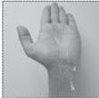

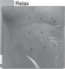

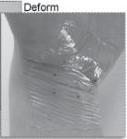

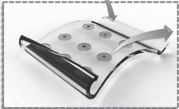

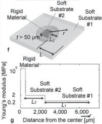

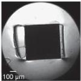

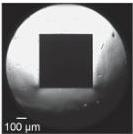

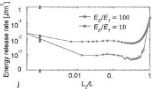

Figure 1. Material gradients in stretchable electronics for integrated functionality. a–d) Embedded rigid silicon chips similar to CMOS material in a PDMS stretchable system under controlled strain conditions with no strain (a), and a magnified image (b), and then under highly strained conditions (c), and a magnified image (d). e) Schematic concept for embedded, distributed, and interconnected electronics chips in stretchable systems. f) Schematic of the material gradient approach for one intermediate material between hard silicon and soft substrate materials, with g) Young's modulus of the materials based on location in the system along the length. Stretchable integrated system under experimental strain examining the h) delamination of the polymer from the silicon chip under 20% strain for sample without the intermediate material, and i) the lack of delamination of our two-polymer approach even up to 140% strain. j) Energy release rate for two different cases ($E_2/E_1 = 10$ and 100) under 5% strain.

Another prior approach reports a supercapacitor technology employing 1.1 cm² 100 µm-thick poly(ethylene terephthalate) (PET) (with modulus 2.0–2.7 GPa) films that hold the nanotube-based supercapacitor devices and that are placed on 0.8 mm-thick Ecoflex.[10] Similar patches of PET are embedded within the Ecoflex to help suppress strain local to the device substrate patches and increase the shear area, demonstrating operation up to 100% uniaxial stretching and 300% localized internal strain. A similar approach used patches of SU8 epoxy to lower stress around 150 nm-thick rigid alumina disks for up to 20% stretching.[14] The general intent of locally suppressing strain has similarities to our work. However, the devices are on the surface where no interface exists for normal stress to cause delamination. In contrast, our work introduces a stiffness gradient within the stretchable substrate that moves the peak strain away from the rigid/elastomeric interface. Eliminating the delamination effects between the soft and rigid material is required for design of stretchable systems that will embed standard microfabricated electronics (i.e., CMOS). Encapsulation of silicon chips into the substrate material may be desired to realize beneficial functions such as inherent packaging that prevents particulate exposure and physical damage by direct contact, especially in wearable applications.

To quantify the delamination characteristic of the interface, the "energy release rate," $G$ in units of J m$^{-2}$, from the field of fracture mechanics[23] must be examined, and its use as a metric guides the fabrication of these integrated flexible electronic systems. The energy introduced to an initiated crack causing it to increase in size must be balanced by the amount of energy lost due to the formation of new surfaces and other dissipative processes, such as plasticity. The crack size increases when the energy release rate equals a critical value, the fracture energy denoted as $\Gamma$. The risk of delamination at the interface between a soft material and rigid material is significant and this risk increases when the system is stretched and thus subjected to mechanical strain. Therefore, if the structure has sufficiently high stress at the interface between the two materials, delamination occurs (Figure 1h). To address this challenge, the amount of strain and strain energy in the soft material at the interface needs to be minimized to prevent delamination. This minimization is accomplished using a combined computational and experimental approach where we incorporate an intermediate material gradient such that the mechanical stiffness properties between the soft and rigid materials are changed gradually (Figure 1f,g,i). Adding a single intermediate material, having a stiffness value between the soft and rigid materials, has a significant effect in reducing delamination and allows for the integration of small rigid components such as CMOS chips.

In our experimental implementation approach, the substrate that surrounds the silicon-based chip, is made of two soft polymers with different Young's modulus, $E_1$ and $E_2$ ($E_2 > E_1$) (Figure 1f; fabrication details in Figure S2, Supporting Information). The stiffer intermediate polymer (Young's Modulus $E_2$) is in contact with the silicon while the softer material (Young's Modulus $E_1$) occupies the outer domain (Figure 1g). When the composite substrate is strained, the outer polymer has a higher strain when compared to the intermediate inner polymer. The value of Young's modulus, $E_2$, of the intermediate material, which is fabricated adjacent to the primary soft substrate material, plays an important role in minimizing the delamination in the flexible system. We examined the effect of the ratio, $E_2/E_1$, by calculating the energy release rates using a 2D finite element analysis (FEA). The two conditions $E_2/E_1 = 10$ and $E_2/E_1 = 100$ in Figure 1j indicate the significance of the Young's modulus ratio on delamination of layers. The energy release rate values for additional ratios are provided in Figure S7, Supporting Information. We control the length of the intermediate material, $L_2$, and also hold the total length of the soft material ($L = L_1 + L_2$) constant, where $L_1$ is the length of the primary soft material. External strain as a boundary condition is held constant at 5% for all cases. The system having the higher Young's modulus ratio has the lowest energy release rate for all values of $L_2$ (Figure 1j). As the energy release rate rises with external applied strain, the system with the higher Young's modulus ratio results in a larger safe region where delamination does not occur. Importantly, for any case where an intermediate material is utilized, the energy release rate is lower when compared to just a single soft material having either Young's modulus $E_1$ or $E_2$.

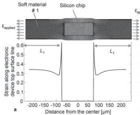

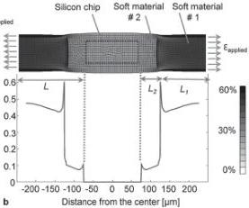

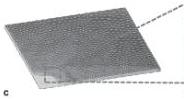

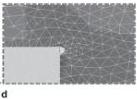

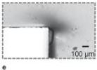

Figure 2. Finite-element modeling of strain associated with the two-material stretchable systems. Maximum principal elastic strain analysis for a) an embedded hard material indicative of a CMOS silicon chip in a soft material without intermediate material ($E_1 = 0.26$ MPa, $L_2 = 0$, $L = 175$ $\mu$m, $\varepsilon_{applied} = 50\%$, elastic substrate thickness = 90 $\mu$m), and b) embedded hard material in the two-material gradient stretchable system ($E_2/E_1 = 7.6$, $L_2 = 50$ $\mu$m, $L = 175$ $\mu$m, $\varepsilon_{applied} = 50\%$, elastic substrate thickness = 90 $\mu$m). c) Finite-element model and d) close-up of mesh for calculating energy release rate for a hard material embedded into a soft polymer ($E_1 = 0.26$ MPa, $L_2 = 0$, $L = 3$ mm, $\varepsilon_{applied} = 20\%$, elastic substrate thickness = 90 $\mu$m). e) Experimentally determined delamination at the edges of a rigid and soft material interface without a material gradient under 20% strain.

Results from the finite-element analysis (ANSYS, Canonsburg, PA, USA) are shown in Figure 2. Maximum principal elastic strain for two structures without (Figure 2a and Figure S9, Supporting Information) and with (Figure 2b) the engineered substrate, indicate the amount of strain in the cut-plane coinciding with the top surface of silicon chip. The strain at the interface between the silicon and the intermediate soft material in the engineered substrate is approximately six times smaller than in the substrate having only a single soft material. This lower strain region at the silicon interface to the engineered substrate reduces the onset of delamination from the silicon chip. In this case, the highest strain occurs at the interface between the primary and intermediate soft materials; accordingly, this region is the most susceptible to delamination. However, by selecting two materials with strong bonding capability, the structure can be designed to withstand higher strains before delamination. Finding two soft elastomeric materials with strong bonding is accomplished experimentally by using poly(dimethylsiloxane) (PDMS) (Sylgard 184 Dow Corning) and varying the elastomer base-to-curing agent mixing ratio.[24] PDMS is widely used in microfabrication and in flexible electronics.[25-27] Bonding between the two soft materials can be enhanced by selecting materials with high surface adhesion. For example, PDMS and Ecoflex have a strong bonding interface. Also, in general, an enhanced interface roughness will have a positive effect on bonding between the two soft materials.

Table 1. Energy release rate results through our finite-element analysis for three stretchable silicon–PDMS systems; a = 10 μm, EPDMS(20:1) = 0.26 MPa, EPDMS(5:1) = 1.98 MPa, ε = 20%, silicon chip size is 1 mm × 1 mm × 50 μm.

|  Sample | Primary material | Intermediate material | Energy release rate [J m⁻²]  |
| --- | --- | --- | --- |
|  #1 | PDMS (5:1), L = L₂ = 3 mm | none | 10.99  |
|  #2 | PDMS (20:1), L = L₁ = 3 mm | none | 1.493  |
|  #3 | PDMS (20:1), L₁ = 2 mm | PDMS (5:1), L₂ = 1 mm | 0.689  |

In order to investigate the intermediate soft material approach, three types of samples, listed in Table 1, are designed, fabricated, and analyzed. For the rigid components, 1 mm × 1 mm × 50 μm silicon chips are used as surrogate electronic devices (Figure 3 and 4). For the compliant region of these structures, two mixtures of PDMS are used as soft materials (base-to-curing ratios 5:1 and 20:1). Using PDMS with different ratios of base and curing agent for the primary and intermediate materials allows us to modify Young's modulus values between regions while still achieving strong bonding at their interface. Samples #1 and #2 are made completely of a single type of PDMS, while sample #3 implements the composite structure with intermediate and primary PDMS.

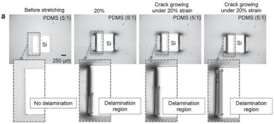

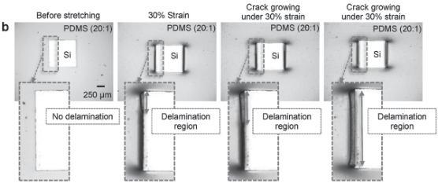

Figure 3. Experimental results of delamination at the interface of the silicon and PDMS interface without intermediate material. a) The silicon–PDMS (5:1) stretchable substrate, sample #1, when placed under a ramped strain test and fails at 20% strain displays a subsequent increase in the delamination area. b) The silicon–PDMS (20:1) stretchable substrate, sample #2, is similarly tested and fails at 30% strain.

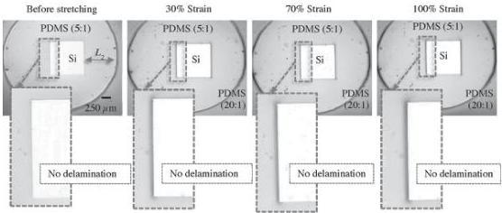

Figure 4. The silicon–PDMS stretchable substrate, sample #3, with the intermediate soft material ($L_2 = 1$ mm, $L_2/L = 0.33$) withstands a significantly higher strain before failure. Delamination does not occur under this ramped strain test at the silicon–PDMS interface up to 100% strain. At 100% strain, failure occurs at the PDMS–PDMS interface.

The energy release rate, which indicates the likelihood of delamination, was determined for a given interface using an FEA with a symmetric quarter model of the entire substrate (Figure 2c). A fine mesh was placed on an initial 10 $\mu$m-wide separation (i.e., a crack initiator) located at the interface between the sidewall of the rigid silicon chip and the surrounding PDMS. The crack with the highest degree of stress was located at the corner of the chip (Figure 2d). The energy release rate was determined by subtracting the strain energy before and after crack growth, while dividing by the area of the crack. Mesh refinements were used to verify numerical convergence. The energy release rates in Table 1 indicate that the stiffest, PDMS (5:1), sample #1 is over 7 times higher than the PDMS (20:1) sample #2. The energy release rate for sample #3 was found to be approximately two times lower than the next best case of sample #2. When the energy release rate exceeded the critical value, as determined empirically, the crack propagated and PDMS delaminated from the silicon chips (Figure 2e). As a result of the lowest energy release rate occurring for sample #3, the risk of delamination at the interface was low and the interface remained intact (Figure 1i).

To compare the experimental result to our finite-element predictions and to quantify the onset of strain failure, we performed tensile tests for all three sample types. In the envisioned application, the silicon chips are assumed to be no greater than 1 mm in size and sparsely embedded, while the radius of bending curvature of the soft substrate is expected to be much greater than 1 mm. Bending tests were not performed; however, these effects should be evaluated further in applications where the bending curvature is similar to or smaller than the size of the chips, for example, in approaches incorporating sub-micrometer thick electronic chips.$^{[28]}$ Tensile strain loading at each end of the substrate was applied as a series of small incremental step functions. The system was elongated at a low strain rate (0.001 s$^{-1}$) to achieve a pseudo steady-state and the strain failure was examined through optical microscopy imaging. Delamination for sample #1 occurred at 20% strain, as indicated by a crack initiation and subsequent growth (Figure 3a). The strain for delamination for sample #2 was higher, occurring at 30% strain at the silicon interface (Figure 3b) and in line with the finite-element predictions (Table 1). The silicon-PDMS (5:1) interface in sample #3 (Figure 4) did not delaminate. Instead, crack growth occurred at the interface of the PDMS (5:1) and PDMS (20:1) materials rather than at the silicon interface, and initiated at 100% strain. This strain failure threshold was six times larger than that of sample #1 (with the silicon-PDMS (5:1) interface). The strain cycling performance of sample #3 up to 100 cycles under maximum 50% strain was studied. Delamination was not detected at either interface (Figure S11, Supporting Information).

Investigating the conditions of this primary-intermediate soft material platform will guide design to decrease the risk of delamination at the PDMS–PDMS interface even further. To minimize the delamination risk, we analyzed our structure based on the ratio of the length of intermediate polymer, $L_2$, to the total substrate length, $L = L_1 + L_2$. The energy release rates for different values of $L_2/L$ ratio at the interface of silicon-PDMS (5:1) and at the interface of PDMS (5:1)-PDMS (20:1) were calculated; respective representative crack locations are shown in Figure 2d and 5c. At these interfaces, material properties and geometric design parameters affect the energy release rate function (G):

$$G = f(a, E_1, E_2, \varepsilon, L_1, L_2, h_1, h_2, h_3) \tag{1}$$

where $a$ is the crack length, $\varepsilon$ is the applied strain, $h_1$ is the thickness of the primary material on top of the chip, $h_2$ is the thickness of the intermediate material on top of the chip, and $h_3$ is the thickness of the silicon chip.

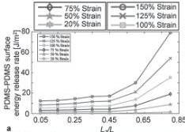

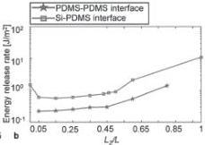

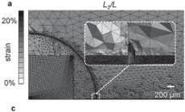

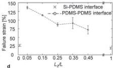

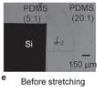

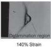

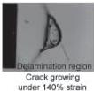

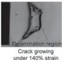

Figure 5. Determining an improved geometry for the stretchable material gradient system. a) The energy release rate for the PDMS–PDMS interface, analogous to sample #3 but with various L₂/L ratios, (σ = 10 μm, E_PDMS(20:1) = 0.26 MPa, E_PDMS(5:1) = 1.98 MPa) under increasing strains. b) An energy release rate comparison between silicon–PDMS and PDMS–PDMS interfaces for structures with different L₂ and a strain of 20%. c) Maximum principal elastic strain analysis, which is then experimentally tested showing the d) delamination strain values for structures with different L₂ at the silicon–PDMS and PDMS–PDMS interfaces. e) Time lapse images of the material gradient substrate with L₂/L = 0.05 during the application of 140% strain.

For this initial study, all parameters except $L_2$ are assumed to be fixed. The energy release rate increases with increasing applied strain with approximately quadratic dependence (Figure S10, Supporting Information). This nonlinear dependence of $G$ on strain arises in Figure 5a, which also illustrates a nonlinear dependence on L₂. A comparison in Figure 5b of energy release rates at 20% strain for the silicon–PDMS interface (squares) and for the PDMS (5:1)–PDMS (20:1) interface (stars) indicates that G for the silicon–PDMS interface is roughly two times higher than for the PDMS–PDMS interface. In this graph, L₂/L = 0 represents the sample #1 case and L₂/L = 1 represents the sample #2 case, with these endpoint values corresponding to those in Table 1.

For intermediate values of L₂/L, the energy release rate at the silicon–PDMS interface decreased significantly. Determining which interface (silicon–PDMS or PDMS–PDMS) failed first was challenging due to different reported critical energy release rate values for these materials.[29] To determine the values, an experimental delamination strain test was conducted for these interfaces. Tensile responses of the material gradient systems were examined on samples with different L₂/L (0.05, 0.15, 0.25, 0.35, 0.45) and a fixed L = 10 mm, while keeping the other dimensions, materials, and loading conditions constant. These sample tests quantified the strain level at the onset of delamination (Figure 5d) and showed in all cases that the PDMS–PDMS interface failed first. The failure strain values for the samples without intermediate material, L₂/L = 0 and L₂/L = 1 as indicated by the crosses in Figure 5d, were relatively small. The highest failure strain of 140% occurred with the geometric condition of L₂/L = 0.05 (Figure 5c and 5d (circles)). Time-lapse images of the response of this sample during crack growth are shown in Figure 5e. The effects on G of h₃/h₂, h₁/h₂, and E₂/E₁ are shown in Figure S5, S6, and S7 (Supporting Information), respectively. Delamination typically happens at corners, edges, and regions of the chip-PDMS interfaces where there is high strain. Having rounded corners or circular chips can reduce the energy release rate. As an indication of this effect, the strain fields around a circular chip and a square chip are compared in Figure S8, Supporting Information.

Investigators have reported values in the range of 0.05–0.4 J m⁻² for the adhesion energy of Si–PDMS interfaces.[29] The work of adhesion for a PDMS–PDMS interface is reported in the range of 250–300 J m⁻².[30] Therefore, the PDMS–PDMS bonding is stronger than Si–PDMS bonding by four orders of magnitude. While the Si–PDMS adhesion could possibly be enhanced through a geometric interlock design or through use of adhesion promoters, the presented method of moving the critical interface to the PDMS–PDMS interface enables exploitation of the natural adhesion between similar polymers.

The ability to create a material stiffness gradient near the interfaces of rigid materials can open up new avenues for the area of flexible and stretchable electronics. Tremendous advances will be made in new applications by combining rigid CMOS electronics, with the ability to pack electronic functionality into sub-mm³ volumes, with the flexibility advantages of soft materials. The challenge of interfacing these two-material systems has been alleviated here through the use of an intermediate gradient material. The presence of the intermediate soft material with a Young's modulus between that of the primary soft material and the silicon substrate decreases the risk of delamination of the soft material from embedded silicon chips. With this approach, 140% strain before failure is achievable, while similar structures without intermediate soft material fail at ≈20% strain. Our coupled computational and experimental findings demonstrate quantitatively the promise of this approach to reduce delamination under high external strain levels. The sixfold increase in failure strain by employing an intermediate material layer is an important basis for the next generation of stretchable electronics on the skin that must function under high strain and will also be important in areas including biomaterials, other flexible electronics, and biomimetics. Design assessment in terms of energy release rate provides a metric for optimization of patterned stiffness gradients to further alleviate delamination and lower stress around interconnects. Future potential refinements of this technique include the addition of more discrete material layers to further smooth the stiffness gradient or the implementation of a continuous stiffness gradient through process innovation. Further process extensions merged with interconnects are expected to lead to large area, very thin stretchable electronic substrates that integrate standard microfabricated integrated circuit technology.

## Experimental Section

The stretchable substrate was created using PDMS with mixing ratios of base to curing agent of (5:1) and (20:1). Young's modulus values of PDMS (5:1), E₁ = 1.98 MPa, and of PDMS (20:1), E₁ = 0.26 MPa, were measured using an Instron 5940 system (Figure S1 and S3, Supporting Information). The stretchable substrates corresponding to the circled point in Figure 2b were made by embedding a 1 mm × 1 mm × 50 μm silicon chip (E = 170 GPa) into a 90 μm-thick PDMS sheet. The PDMS ratio for sample #1 is (5:1), for sample #2 is (20:1), and sample #3 is made by a combination of PDMS (5:1) as the intermediate soft material and PDMS (20:1) as the primary soft material (Figure 4). To make the two-material substrate, a handle wafer was spin coated with 10 μm-thick PDMS (5:1), the silicon chip was transferred, and a second 60 μm-thick PDMS (5:1) layer was spin coated and then cured at 80 °C for 4 h. This composite structure was then etched into a 1 mm diameter circle and released from the handle wafer and subsequently transferred to a second handle wafer having an initial 10 μm-thick spin-coat PDMS (20:1) layer. The composite structure was embedded into PDMS (20:1) by spin coating an additional 80 μm-thick PDMS (20:1) layer followed by 4 h curing at 80 °C. The soft PDMS (20:1) material covered the intermediate structure by ≈10 μm on its top and bottom surfaces (Figures S2–S4, Supporting Information). The dimension of the intermediate material for sample #3 is L₂ = 1 mm.

## Supporting Information

Supporting Information is available from the Wiley Online Library or from the author.

Received: November 24, 2015

Revised: February 15, 2016

Published online: March 17, 2016

[1] C. Y. Lee, G. W. Wu, W. J. Hsieh, Sens. Actuators, A 2008, 147, 173.

[2] D.-H. Kim, R. Ghaffari, N. Lu, S. Wang, S. P. Lee, H. Keum, R. D'Angelo, L. Klinker, Y. Su, C. Lu, Y.-S. Kim, A. Ameen, Y. Li, Y. Zhang, B. de Graff, Y.-Y. Hsu, Z. Liu, J. Ruskin, L. Xu, C. Lu, F. G. Omenetto, Y. Huang, M. Mansour, M. J. Slepian, J. A. Rogers, Proc. Natl. Acad. Sci. USA 2012, 109, 19910.

[3] S. Xu, Y. Zhang, J. Cho, J. Lee, X. Huang, L. Jia, J. A. Fan, Y. Su, J. Su, H. Zhang, H. Cheng, B. Lu, C. Yu, C. Chuang, T.-I. Kim, T. Song, K. Shigeta, S. Kang, C. Dagdeviren, I. Petrov, P. V. Braun, Y. Huang, U. Paik, J. A. Rogers, Nat. Commun. 2013, 4, 1543.

[4] H. Ryu, S. J. Cho, B. Kim, G. Lim, RSC Adv. 2014, 4, 39767.

[5] D.-H. Kim, R. Ghaffari, N. Lu, J. A. Rogers, Annu. Rev. Biomed. Eng. 2012, 14, 113.

[6] P. Egan, R. Sinko, P. R. LeDuc, S. Keten, Nat. Commun. 2015, 6, 7418.

[7] G. Gustafsson, Y. Cao, G. M. Treacy, F. Klavetter, N. Colaneri, A. J. Heeger, Nature 1992, 357, 477.

[8] X. Liu, Y. Z. Long, L. Liao, X. Duan, Z. Fan, ACS Nano 2012, 6, 1888.

[9] S. Xu, Y. Zhang, L. Jia, K. E. Mathewson, K.-I. Jang, J. Kim, H. Fu, X. Huang, P. Chava, R. Wang, S. Bhole, L. Wang, Y. J. Na, Y. Guan, M. Flavin, Z. Han, Y. Huang, J. A. Rogers, Science 2014, 344, 70.

[10] Y. Lim, J. Yoon, J. Yun, D. Kim, S. Y. Hong, S. Lee, G. Zi, J. S. Ha, ACS Nano 2014, 8, 11639.

[11] A. J. Baca, M. A. Meitl, H. C. Ko, S. Mack, H. S. Kim, J. Dong, P. M. Ferreira, J. A. Rogers, Adv. Funct. Mater. 2007, 17, 3051.

[12] W. A. MacDonald, M. K. Looney, D. MacKerron, R. Eveson, R. Adam, K. Hashimoto, K. Rakos, J. Soc. Inf. Disp. 2007, 15, 1075.

[13] H. Tu, Y. Xu, Appl. Phys. Lett. 2012, 101, 052106.

[14] A. Romeo, Q. Liu, Z. Suo, S. P. Lacour, Appl. Phys. Lett. 2013, 102, 131904.

[15] G. H. Gelinck, H. E. A. Huitema, E. van Veenendaal, E. Cantatore, L. Schrijnemakers, J. B. P. H. van der Putten, T. C. T. Geuns, M. Beenhakkers, J. B. Giesbers, B.-H. Huisman, E. J. Meijer, E. M. Benito, F. J. Touwslager, A. W. Marsman, B. J. E. van Rens, D. M. de Leeuw, Nat. Mater. 2004, 3, 106.

[16] N. Lu, J. Yoon, Z. Suo, Int. J. Mater. Res. 2007, 98, 717.

[17] D.-H. Kim, N. Lu, R. Ma, Y.-S. Kim, R.-H. Kim, S. Wang, J. Wu, S. M. Won, H. Tao, A. Islam, K. J. Yu, T. Kim, R. Chowdhury, M. Ying, L. Xu, M. Li, H.-J. Chung, H. Keum, M. McCormick, P. Liu, Y.-W. Zhang, F. G. Omenetto, Y. Huang, T. Coleman, J. A. Rogers, Science 2011, 333, 838.

[18] R. Dinyari, S.-B. Rim, K. Huang, P. B. Catrysse, P. Peumans, Appl. Phys. Lett. 2008, 92, 091114.

[19] T. D. Y. Kozai, Z. Gugel, X. Li, P. J. Gilgunn, R. Khilwani, O. B. Ozdoganlar, G. K. Fedder, D. J. Weber, X. T. Cui, Biomaterials 2014, 35, 9255.

[20] D. S. Gray, J. Tien, C. S. Chen, Adv. Mater. 2004, 16, 393.

[21] H. Huang, F. Spaepen, Acta Mater. 2000, 48, 3261.

[22] S. Sosin, T. Zoumpoulidis, M. Bartek, R. Dekker, in Proc. 59th IEEE Electron. Components Technol. Conf., IEEE, Piscataway, NJ, USA, 2009, pp. 1059–1064, DOI: 10.1109/ECTC.2009.5074143.

[23] F. Z. Li, C. F. Shih, A. Needleman, Eng. Fract. Mech. 1985, 21, 405.

[24] R. V. Martinez, J. L. Branch, C. R. Fish, L. Jin, R. F. Shepherd, R. M. D. Nunes, Z. Suo, G. M. Whitesides, Adv. Mater. 2013, 25, 205.

3590

wileyonlinelibrary.com

© 2016 WILEY-VCH Verlag GmbH & Co. KGaA, Weinheim

Adv. Mater. 2016, 28, 3584–3591

---

Materials Views

www.MaterialsViews.com

ADVANCED MATERIALS

www.advmat.de

[25] J. Song, J. H. Shawky, Y. Kim, M. Hazar, P. R. LeDuc, M. Sitti, L. A. Davidson, Biomaterials 2015, 58, 1.
[26] M. E. Wilson, N. Kota, Y. Kim, Y. Wang, D. B. Stolz, P. R. LeDuc, O. B. Ozdoganlar, Lab Chip 2011, 11, 1550.
[27] C. M. Cheng, C. Y. Yang, Y. Kim, P. R. Leduc, Appl. Phys. Lett. 2013, 102, 2011.
[28] H. Cheng, Y. Zhang, K. C. Hwang, J. A. Rogers, Y. Huang, Int. J. Solids Struct. 2014, 51, 3113.
[29] R. Saeidpourazar, M. D. Sangid, J. A. Rogers, P. M. Ferreira, J. Manuf. Process. 2012, 14, 416.
[30] K. L. Mills, X. Zhu, S. Takayama, M. D. Thouless, J. Mater. Res. 2008, 23, 37.

COMMUNICATION

Adv. Mater. 2016, 28, 3584–3591

© 2016 WILEY-VCH Verlag GmbH & Co. KGaA, Weinheim

wileyonlinelibrary.com 3591