FULL PAPER

Stretchable Electronics

ADVANCED MATERIALS INTERFACES

www.advmatinterfaces.de

# EGaIn–Metal Interfacing for Liquid Metal Circuitry and Microelectronics Integration

Kadri Bugra Ozutemiz, James Wissman, O. Burak Ozdoganlar,* and Carmel Majidi*

Eutectic gallium–indium (EGaIn) has attracted significant attention in recent years for its use in soft and stretchable electronics. However, advances in scalable fabrication approaches and effective electromechanical interfaces between liquid metal (LM) traces and microelectronics are still needed to create functional soft and stretchable electronics. In this study, EGaIn–metal interfacing for the effective integration of surface-mount microelectronics with LM interconnects is investigated. The electrical interconnects are produced by creating copper patterns on a soft-elastomer substrate, and subsequently exposing the substrate to EGaIn, which selectively wets the Cu traces. To create strong electromechanical connection between EGaIn and microelectronics, the terminals of the LM-coated traces are “soldered” to the metal pins of the packaged microelectronic circuits using a novel HCl-vapor treatment. In combination, the fabrication and microelectronics-interfacing approaches enable creating stretchable circuits composed of LM wiring and packaged microelectronics. It is found that the HCl-vapor treatment significantly improves electrical conductivity at the LM–pin interface while enhancing the strain limit of the soft circuits and the reproducibility of the interface. The applicability of this approach in creating soft-matter circuits is demonstrated through two illustrative examples—a circuit with a digital 9-axis inertial measurement unit and a temperature sensor; and a circuit with a 3-axis analog accelerometer.

K. B. Ozutemiz, Dr. J. Wissman, Prof. O. B. Ozdoganlar, Prof. C. Majidi
Department of Mechanical Engineering

Carnegie Mellon University

Pittsburgh, PA 15213, USA

E-mail: ozdoganlar@cmu.edu; cmajidi@andrew.cmu.edu

Prof. O. B. Ozdoganlar, Prof. C. Majidi

Department of Biomedical Engineering

Carnegie Mellon University

Pittsburgh, PA 15213, USA

Prof. O. B. Ozdoganlar, Prof. C. Majidi

Department of Materials Science and Engineering

Carnegie Mellon University

Pittsburgh, PA 15213, USA

The ORCID identification number(s) for the author(s) of this article can be found under https://doi.org/10.1002/admi.201701596.

DOI: 10.1002/admi.201701596

## 1. Introduction

Soft-matter circuits that can support large amounts of bending, stretching, and other modes of deformation are needed in a broad range of emerging applications, from wearable computing to soft robotics. Such deformable electronics provide increased robustness and better mechanical impedance matching with the host material or structure. For instance, they can be integrated into clothing or mounted on the skin without constraining natural body motion or causing discomfort. A promising approach for realizing stretchable electronics is to create microfluidic traces of liquid-metal (LM) embedded in a soft elastomer.[1–3] Ga-based LM circuits offer attractive advantages over alternative approaches. Stretchable electronics based on soft-elastomers embedded with percolating networks of rigid metallic particles,[4,5] carbon allotropes,[6,7] or conductive polymers[8,9] typically suffer from low conductivity (three orders of magnitude lower than metals) or poor electromechanical properties. Micro/nanoscale geometries of thin conductive elements (e.g., serpentine and “wavy” electronics) represent a promising alternative that achieves stretchable functionality through flexure or twisting on a prestrained elastomer substrates.[10–14] However, obtaining stretchability with deterministic architectures requires conductive traces to be patterned into specific geometries (e.g., prebuckled waves, planar serpentines) that are only deformable in prescribed directions. By contrast, Ga-based LM alloys, such as eutectic Ga–In (EGaIn; 75% Ga and 25% In, by weight) and Ga–In–Sn (Galinstan; 68% Ga, 22% In, 10% Sn), can be incorporated into elastomers and preserve their elastic properties at all length scales and in all loading conditions without requiring specialized geometries.[15] These alloys provide high electrical conductivity (3.4 × 10⁶ S m⁻¹), low melting point (−19 °C for Galinstan, 15 °C for EGaIn), low viscosity (2 mPa s), low toxicity,[16] and negligible vapor pressure.[1,15] Since they are liquid at room temperature and have metallic conductivity, EGaIn and Galinstan can function as intrinsically stretchable and deformable conductors that are not subject to the limitations of conductive polymers or deterministic architectures. As such, LM-based electronics can provide a unique combination of metallic conductivity and elastomeric deformability. Although this promise of LM-based electronics has been well recognized in recent literature,[17] advances in scalable fabrication approaches and effective electrical interfaces between liquid metal traces and microelectronics are still needed to create functional and practical soft and stretchable electronics.

Adv. Mater. Interfaces 2018, 5, 1701596

1701596 (1 of 13)

© 2018 WILEY-VCH Verlag GmbH & Co. KGaA, Weinheim

---

ADVANCED
SCIENCE NEWS

www.advancedsciencenews.com

ADVANCED
MATERIALS
INTERFACES

www.advmatinterfaces.de

In this work, we evaluate a unique approach to interface LM with integrated circuit (IC) microchips by using HCl-vapor assistance to “solder” the metal pins of the surface-mount microelectronic devices (SMD) with EGaIn interconnects. The LM circuits are produced through selective deposition (wetting) of EGaIn on a soft elastomer substrate. This is accomplished by exploiting the high surface tension (≈435 mN m⁻¹[3]; in the absence of surface oxide) of Ga-based alloys and its selective wetting to metals like Cu[18,19] and Au.[20–22] When exposed to oxygen (e.g., in air), the alloys form a thin (0.5–2.5 nm[3]), self-passivating gallium-oxide (Ga₂O₃) layer that allows for nonselective wetting to a variety of surfaces.[15]

Previous methods for EGaIn and Galinstan circuit fabrication include direct-writing,[23–29] injection,[30–32] ink-jet printing,[33,34] laser patterning,[35] contact printing,[36] imprinting,[37] selective wetting,[20–22,38–41] screen printing,[42,43] spray painting,[44] and reductive patterning.[45] Microfluidic channels of EGaIn embedded in a soft elastomer, e.g., polydimethylsiloxane (PDMS), can function as highly stretchable wires[18–44] and passive circuit elements.[32,36,37] Such architectures have also been used for diodes and memristors,[46,47] deformation sensors,[32,36,37] and mechanically or electrochemically tunable antennas.[48–50] Recently, there has been interest in “biphasic” architectures in which patterned metal thin-films (typically Au) are used as a wetting layer on which to selectively deposit liquid metal.[20–22,38,39] What is particularly attractive about this approach is that it can be integrated in the standard process flow of traditional lithographic microfabrication techniques, thus enabling microscale linewidths, a high level of reproducibility, complex circuit architectures, and very high throughput. There has also been increasing focus on the integration of IC chips and other microelectronics to form multifunctional stretchable circuit assemblies. Indirect integration with a rigid printed circuit board (PCB) adapter[51] or z-axis conductive film[52,53] and direct integration of an IC chip with “gull wing” leads,[24] a bare CMOS die,[54] and a custom-fabricated thin film transistor[55] have all been demonstrated and the charge transport characteristics of self-assembled monolayer/EGaIn tunneling junctions have been studied.[56] However, direct wetting and interfacial characteristics between LM circuit terminals and the pins of IC microchips have not previously been investigated.

Here, we combine biphasic stretchable electronics with a novel microelectronics interfacing approach to produce fully functional liquid metal circuits. To describe the overall approach of fabrication and IC microelectronics integration, we outline the steps for the fabrication of stretchable circuits composed of LM wiring and packaged microelectronics embedded in soft elastomers (Figure 1). The versatility of this method in creating stretchable electronics is demonstrated with several implementations containing different chip packages: one that includes a digital inertial measurement unit (IMU) and a temperature sensor circuit (Figure 1B), and another that includes an analog accelerometer circuit implementation (Figure 1C).

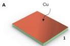

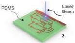

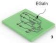

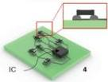

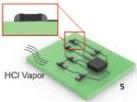

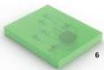

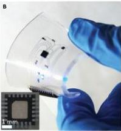

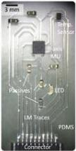

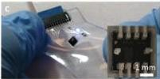

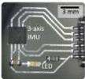

Figure 1. Fabrication flow and representative circuits. A) Schematic illustration of fabrication steps: (1) A copper layer is sputter deposited on PDMS substrate with a Cr adhesion layer. (2) The Cr/Cu layer is patterned to obtain the desired circuit geometry by removing the unwanted portions of the metal using laser ablation. (3) The liquid metal is deposited to the Cu wetting layer by immersing the substrate into 3% NaOH bath and applying LM inside the bath. (4) Microelectronics components are placed on designated locations. The inset depicts the side view of the component after placing on the LM pads. (5) HCl vapor is applied to the circuit to “solder” LM and component pins. The inset depicts the side view of the component after the treatment. (6) The circuit is sealed by curing another layer of elastomer on the surface. B) A photograph of a hybrid stretchable circuit consisting of a digital IMU and a digital temperature sensor under deformation. The inset shows the top view of the component–LM interface at the component pads. C) A photograph of a hybrid stretchable circuit consisting of a 3-axis analog accelerometer under stretch. The inset shows the component–LM interface at the component pads.

Adv. Mater. Interfaces 2018, 5, 1701596

1701596 (2 of 13)

© 2018 WILEY-VCH Verlag GmbH & Co. KGaA, Weinheim

---

ADVANCED
SCIENCE NEWS

www.advancedsciencenews.com

ADVANCED
MATERIALS
INTERFACES

www.advmatinterfaces.de

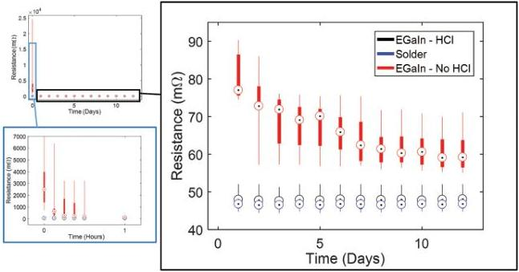

Figure 2. Change of interfacial resistance over time. (Top left) Change in resistance of the test circuits over days for the samples with component soldered with conventional solder (CSP), EGaIn without any treatment (non-HCl), and EGaIn with HCl treatment (HCl). (Right) The figure is the magnified plot of the top-left plot without the resistance measurement made at day 0 (the measurements taken immediately after circuits were made). (Bottom) Figure shows the change of resistance of the samples during the first hour after the circuits were fabricated. The data in all figures were plotted as box plots showing the range of all collected data. The circles mark the median value while the bottom and top edges of boxes show 25 and 75 percentile values, respectively. The vertical lines were drawn between the minimum and the maximum values in each dataset.

## 2. Results and Discussion

### 2.1. Electrical Contact between Liquid Metal and the Component Pins

We experimentally investigate the electrical connection between liquid metal interconnects and the component pins with and without HCl vapor soldering. EGaIn is used in this study, since it can be easily synthesized with a controlled metal composition (see the Experimental Section). We prepared a test circuit design on a conventional PCB board, consisting of two Cu interconnects that are connected by a zero-ohm surface-mount resistor. Circuit resistance was measured using a microohmmeter with 4-point contact probes. The purpose of this arrangement is to isolate the properties of LM-component interface from mechanical and electrical effects of the LM leads (interconnects). The fabrication of test samples and experimental settings are described in the Experimental Section. The dimensions of the design are given in Figure S4A (Supporting Information). LM was deposited only on the portion of the Cu pads where the component was to be connected. In total, three sets of 10 test samples were fabricated. In one set, conventional solder paste was used to connect the component with the interconnect pads using reflow soldering (the conventional solder paste (CSP) set). This set was considered as the reference, since it was produced with conventional PCB fabrication methods. In the other two sets, EGaIn was used as the solder material. One of the EGaIn soldered sets was treated with HCl (the HCl set) while the other was not treated (the non-HCl set). To understand how much of the measured resistance corresponds to the LM-component interface, we prepared another set of samples with the same trace dimensions (Figure S4B, Supporting Information) but without any microelectronic component (the no-component (NC) set).

For the cases with EGaIn, the conductivity is measured immediately after placing the microelectronic component onto the applied drops (before the HCl treatment for the HCl set). It was observed that nine out of 20 samples had no immediate electrical conductivity. The HCl treatment was then applied to a subset of 10 samples, and the conductivities of all samples (including the soldered samples) were subsequently tested. The resistances of the conductive samples are presented in Figure 2.

At hour zero, four out of ten of the non-HCl samples had no conductivity: two of those gained conductivity after 15 min, one gained conductivity after 2 d, and one never gained conductivity within the 12 d test period. Furthermore, the six samples that were conductive exhibited very large variations in conductivity values. The resistance from the functional non-HCl samples reduced steadily after day 1. On day 12, the resistance was relatively stable at 60.6 ± 4.9 mΩ. Immediately after the application of HCl vapor, all samples from the HCl-treated set showed a high level of conductivity, similar to those from the CSP set. The resistance remained approximately constant in time, with a very small amount of variability. On average, the resistances of the HCl-set and the CSP set were 48.2 ± 2.0 and 47.2 ± 0.4 mΩ, respectively. The resistance measured from the NC set was 40.9 ± 0.3 mΩ. The resistance measured from the NC set shows that ≈40.9 mΩ of the resistance measured corresponds to the copper interconnects while the remaining value corresponds to the solder–component interface and the component itself.

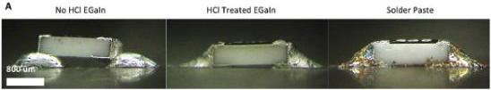

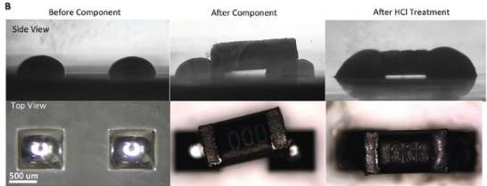

Figure 3. Effect of HCl treatment on self-aligning. A) Side view images of electrical interface test circuits on rigid PCB board. B) Side and top view images of self-alignment test designs on PDMS before/after component placement and before/after HCl vapor treatment.

Figure 3B shows the shape of the liquid metal at the component–LM interface before and after HCl vapor application. Figure 3A shows the side views of a surface-mount resistor in contact with LM-coated Cu contact pads with and without HCl treatment. As a reference, a side view of an SMD–Cu connection obtained using conventional solder paste is also provided. Before the HCl treatment, the component rests on the LM-coated Cu pads and has a limited contact area. When HCl vapor is applied, liquid metal surrounds the component pins (composed of Sn-plated Cu). This not only increases the interfacial contact area, potentially reducing the contact resistance, but also produces a better mechanical connection between the LM and microelectronic component. Referring to the figures, the HCl treated LM–component interface resembles the conventional solder–component interface.

There are clear benefits to using HCl vapor to solder the packaged components to the terminals of the LM circuit. Referring to Figure 2, we observed that immediate and reliable electrical connectivity requires the application of HCl vapor. If vapor is not applied, then electrical contact is still possible but may take hours or days to form. Considering that the component pins are tin coated, this time-dependent connectivity in the absence of HCl is likely governed by the reactive wetting observed between EGaIn and Sn presented by Kramer et al.[57]

Referring to these results, we conclude the following: (i) Without HCl treatment, robust LM–component interfaces cannot be reliably obtained—i.e., they have a low yield (9/20 did not work), exhibit significant changes of conductivity in time, and show considerable variations in conductivity. (ii) When treated with HCl, LM–component interfaces become conductive immediately and maintain a stable contact resistance, with very low variability over time. (iii) Moreover, with HCl treatment, the interface conductance is similar to that of a conventional solder joint. Referring to Figure 3A,B, the interfacial contact area is larger in the treated versus nontreated case and this likely corresponds to a lower contact resistance between the component pins and the LM leads.

## 2.2. Self-Alignment of Components through HCl Treatment

Figure 3B shows the top and side views of the EGaIn drops applied on the Cu pads, initial placement of a component on the pads, and the component after the HCl treatment. Although the component was placed in a misaligned manner with respect to the layout of contact pads, we observed that HCl vapor exposure causes the component to self-align itself with respect to the contact pads. The high surface tension of liquid metal caused the components to self-align. This is a phenomenon observed in reflow soldering,[58] but demonstrated here for the first time for EGaIn–microelectronic interfacing. Video S2 (Supporting Information) demonstrates this behavior on surface-mount resistor–LM interface.

To quantify this self-alignment phenomenon, an evaluation of the self-alignment was conducted for placement of nine components. For this purpose, the misalignment of the components both before and after the application of the HCl vapor was measured. The test design used in this experiment was composed of two LM-contact pads patterned on a Si-wafer backed PDMS substrate. The component (zero-ohm resistor) was placed on these pads manually. The details of the sample fabrication and the experimental settings are given in the

Adv. Mater. Interfaces 2018, 5, 1701596

1701596 (4 of 13)

© 2018 WILEY-VCH Verlag GmbH & Co. KGaA, Weinheim

---

ADVANCED
SCIENCE NEWS

www.advancedsciencenews.com

ADVANCED MATERIALS INTERFACES

www.advmatinterfaces.de

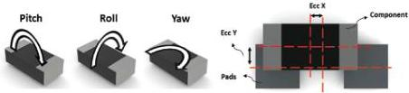

|   |   | Yaw (deg) | Pitch (deg) | Roll (deg) | Height (um) | Ecc X (um) | Ecc Y (um)  |
| --- | --- | --- | --- | --- | --- | --- | --- |
|  Before | Mean | 6.79 | 2.62 | 4.96 | 568.52 | 54.11 | 153.34  |
|   |  Std.dev. | 4.63 | 2.10 | 3.57 | 27.71 | 46.98 | 61.83  |
|  After | Mean | 1.56 | 0.59 | 0.42 | 455.13 | 35.03 | 39.69  |
|   |  Std.dev. | 1.96 | 0.44 | 0.37 | 7.41 | 42.25 | 42.83  |

Figure 4. Results of self-alignment quantification. Illustrations defining the angular and translational misalignment of the component with respect to the contact pads. Table shows the angular and translational misalignments of component with respect to the pads before and after HCl vapor treatment for test designs.

Experimental Section. The dimensions of the design are provided in Figure S5 (Supporting Information).

Figure 4 shows a schematic description of the angular and translational misalignment of a component with respect to the contact pads. The angular misalignments are represented by three Euler angles (roll, pitch, and yaw), and the in-plane translational misalignments are described by the eccentricity (Ecc X and Ecc Y) of the component geometric center with respect to the geometric center of the connection pads on circuit. The average values of these quantities are presented in the table in Figure 4. The HCl treatment considerably reduced the misalignment and associated standard deviation in each Euler angle. Although to a lesser extent, the eccentricity along the in-plane translational axes was also reduced by the HCl treatment. As also seen in Figure 3B, the vertical distance between the substrate surface and the component surface was decreased by the HCl treatment from 568 ± 28 μm to 455 ± 7 μm, which is approximately equal to the component thickness (450 μm according to the manufacturer's datasheet). This means that the gap between the substrate and the component is almost completely closed after the treatment. By reducing the misalignment, such behavior could potentially allow for the fabrication of high density circuits without violating minimum clearances between component pins and between components dictated by printed circuit board manufacturing standards.[59] For prototyping purposes, self-alignment would also eliminate the need for expensive, high-accuracy tools for precision component placement.

### 2.3. Strain Limit and Electromechanical Response

It is important to understand the electromechanical characteristics of the circuits composed of a surface-mount component and liquid metal interconnects. To obtain a quantitative assessment of the electromechanical behavior of the LM-based circuits and component-LM interfaces, quasistatic tensile tests were conducted on specimens containing a zero-ohm surface-mount resistor and LM interconnects (Figure 5A). Two sets of six test samples were fabricated, with one of the sets treated with HCl vapor. Measurements were also performed on an additional pair of two test samples that only had an LM trace with no surface-mount resistor (Figure 5A). Similarly, one of the sets in the LM-only samples was treated with HCl vapor. Details of the specimen fabrication, dimensions, and experimental settings are given in the Experimental Section and Figure S3 (Supporting Information).

Figure 5B shows the relative change in electrical resistance (ΔR/R₀) with the applied strain (ε) and the associated theoretical predictions. The theory is derived from Ohm's Law and assumes that the change in electrical resistance is governed by the change in conductivity of the LM leads. The derivation of the theoretical prediction is given in the Supporting Information. Referring to Figure 5B, the highest strain values at failure—84.5 ± 9.4% with HCl treatment and 86.3 ± 12.6% with no treatment—are observed for the LM-only circuits, i.e., when there is no microelectronic component integrated in the circuit. For the circuits with a microelectronic component, the maximum strain values of 82.6 ± 13.3% and 57.7 ± 7.9% were observed with and without HCl treatment, respectively. These results indicate that the HCl treatment enables LM–microelectronic interfaces with similar stretchability as that of the LM-only circuits. Further, HCl treatment increases the mean strain at failure by ≈25% for circuits with microelectronics components.

As shown in Figure 5B, the strain-resistance behavior agrees with the theoretical estimation in HCl-treated case for up to ≈60% strain and in nontreated case for up to ≈40% strain. Beyond these strains, the strain-resistance behavior deviates significantly from theory. Investigating the LM, lead-component interface reveals the rupturing of the elastomer at the interface and the formation of the voids in which the liquid metal infiltrates (see Figure S10, Supporting Information). As the sample is stretched, the voids grow larger and more LM leaks into the voids until the sample completely fails. Comparing the geometry of LM on the leads (length, width, height are 45 mm, 0.6 mm, ≈30 μm, respectively) with the LM on the contact pads at the component pin interface (length, width, height are 0.8 mm, 0.8 mm, ≈500 μm, respectively), the volumes of the LM on these two regions are comparable. However, assuming LM-pin interface is formed properly, the resistance of the LM at the leads is two orders of magnitude higher than the resistance of the LM at the component pads, and thus, dominates the measured resistance. Therefore, the flow of LM from the leads and pin interface and into the voids is expected to have an effect on the measured resistance. The difference between the theoretical approximation and the experimental results is likely related to the fact that the theoretical approximation ignores this flow of liquid metal at the onset of the mechanical failure and only considers the strain-controlled electromechanical response of the LM leads. A more concrete understanding of the observed phenomenon requires an extended study on the failure mechanisms of LM-based circuits with integrated microelectronic chips.

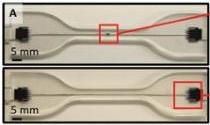

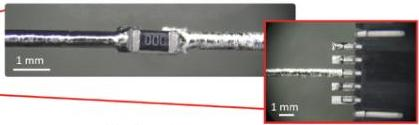

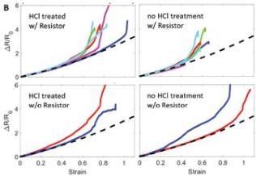

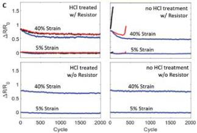

Figure 5. Tensile test specimens and tensile testing results. A) Images of tensile test specimens with and without 0 ohm resistor; (Middle) close-up image shows the component placement to contact pads; (Right) close-up image showing the FFC placement to contact pads. B) Strain versus normalized resistance of tensile test specimens up to failure: (Top left) HCl treated samples with embedded component; (Top right) nontreated samples with embedded component; (Bottom left) HCl treated samples without embedded component; (Bottom right) nontreated samples without embedded component. Theoretical prediction plotted with dashed line. Different colors show the behavior of different samples. C) Maximum and minimum normalized resistance at 40% and 5% strain, respectively, versus number of tensile cycles, with each color indicating a different sample: (Top left) HCl treated samples with embedded component; (Top right) nontreated samples with embedded component; (Bottom left) HCl treated samples without embedded component; (Bottom right) nontreated samples without embedded component. Different colors show the behavior of different samples.

Finally, in all cases we observed that the loss of conductivity is governed by mechanical rupture of the elastomer rather than electrical failure of the LM leads or LM-pin connections. Referring to Figure S9 (Supporting Information), we observe that, for the samples that have embedded components, the failure occurs at the LM-component interface. When loaded to beyond 80% strain, test circuits with embedded rigid components failed due to tearing at the interface between the LM lead and component pin. This location of failure is expected, since the mechanical mismatch will lead to stress concentrations.[60] To examine this further, we investigated the geometry of the LM connection with and without HCl treatment (Figure 3B). With HCl treatment, the interface has a smooth transition that fully encapsulates the ends of the component. By contrast, the nontreated samples exhibit an abrupt transition that connects mainly at the bottom edges of the components. Referring to (Figure 3C), the top views of the HCl treated and nontreated samples show characteristics similar to what we observed from the side views. Furthermore, in nontreated circuits, the component has an arbitrary orientation while in HCl treated circuits, the component is aligned along the axis of interconnects. Such a misalignment that exposes the corners of the components and the cusp-like LM-component interface could both result in stress-concentrations and points of premature delamination that drive the system into mechanical failure. Factoring this additional contribution to electromechanical coupling requires 3D computation modeling of the "three-body" liquid-component-elastomer interface using finite element analysis (FEA). Such an analysis represents an area of future work that could build on recent studies of strain distribution, stress-concentrations, and delamination/failure at the soft-rigid interface within chip-embedded elastomers.[61]

### 2.4. Electromechanical Response during Cyclic Loading

The fabricated circuits are expected to remain functional under various loading conditions and associated strains. To this end, the electromechanical behavior was examined for specimens loaded 2000 cycles between 5 and 40% strain. As with strain limit testing, measurements were performed on four types of specimens: (i) zero-ohm chip with LM leads and HCl treatment, (ii) zero-ohm chip with LM leads and no HCl treatment, (iii) LM trace with HCl treatment and no chip, (iv) LM trace with no HCl treatment or chip.

Figure 5C shows the change of normalized resistance at maximum (upper line) and minimum (lower line) strains with increasing number of cycles. It is observed that all three HCl-treated samples completed the 2000-cycle test without failure. The initial three nontreated samples, on the other hand, all failed within the first 20 cycles (these cases are omitted from Figure 5C). Accordingly, an additional four nontreated samples were fabricated and tested. Out of these new samples, only one survived the 2000-cycle test, and the other three failed before the completion of the test. Similar to the case for tensile testing up to failure, all six nontreated samples that failed prematurely were ruptured in the vicinity of LM-component interface. Video S3 (Supporting Information) shows how the crack at the interface grows with each cycle and results in failure. As in the case of tensile testing up to failure, we attain this higher strain limit and endurance properties of HCl treated rigid component embedded samples to the reduced stress concentration as a result of the following: (i) At the component pin-LM lead interface, LM is fully encompassing the edge of the component pins so that there are no sharp corners. (ii) The embedded component is aligned along the axis of interconnects. Although more loading cycles are required for a complete fatigue study, these preliminary measurements suggest that the electromechanical response is relatively repeatable and that there is no significant electrical hysteresis. All samples that survived 2000 cycles showed a slightly decreasing trend in electrical resistance with each cycle reaching a stable value after several hundred loading cycles. Having no embedded component, a similar trend was presented before for a biphasic (solid-liquid) Au-Ga film.[22] In samples with a microelectronic component, the amount of decrease with each cycle is more pronounced compared to the samples without a component. This result suggests that the observed decrease in resistance is primarily related to the component pin-LM lead interface. Although the normalized resistance values are very close at the initial cycles of the test, we observe a slight overall variation in the cyclic electromechanical behavior of the HCl treated samples having embedded component. This variation might be the result of the sample-to-sample variation in the deposited amount of LM to the LM-component interface.

## 2.5. Fabrication Method

The workflow for circuit fabrication is composed of four main steps: (i) design of the circuit, (ii) fabrication of elastomeric circuit, (iii) electronics interfacing, and (iv) elastomer sealing. The steps of the fabrication method are presented in Figure 1A and details are provided in the Experimental Section. Analogous to PCB manufacturing and assembly, the first step is to design the electronic circuit using a circuit design software (e.g., Autodesk EAGLE). The next step is the fabrication of circuit with liquid metal interconnects. The liquid metal traces are fabricated using a method similar to that in ref. [21], yet with some important modifications. Referring to Figure 1A, first the elastomeric substrate material (PDMS) is obtained by molding and a Cu wetting layer is sputter deposited directly on elastomeric substrate with a chromium (Cr) adhesion layer between Cu and elastomer. We selected Cu as the wetting layer instead of Au, as used in ref. [21], since Cu is ubiquitous for electronics manufacturing, is low-cost, can alloy with EGaIn, and has better adhesion properties to the Cr adhesion layer than Au does. Second, the metal wetting layer is patterned using a ultraviolet-laser micromachining (UVLM) system (Figure 6A(1)). 

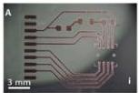

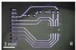

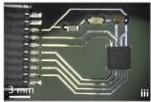

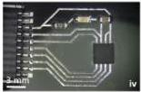

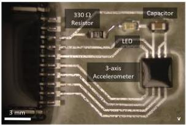

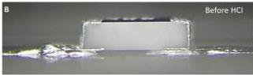

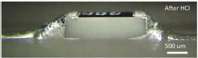

Figure 6. Images of selected fabrication steps. A) Images from fabrication steps of analog accelerometer circuit: (i) patterned copper layer on substrate; (ii) liquid metal deposited on Cu wetting layer; (iii) components placed in their designated locations; (iv) HCl vapor is applied; (v) sealed circuit inside elastomeric medium. B) Side view of liquid metal-component interface on tensile test specimens before and after HCl vapor treatment.

Adv. Mater. Interfaces 2018, 5, 1701596

1701596 (7 of 13)

© 2018 WILEY-VCH Verlag GmbH & Co. KGaA, Weinheim

---

ADVANCED
SCIENCE NEWS

www.advancedsciencenews.com

ADVANCED
MATERIALS
INTERFACES

www.advmatinterfaces.de

As an alternative to direct patterning, the Cr/Cu layer can be patterned by using a laser-cut paper stencil, produced with either UVLM or a CO₂ laser as a shadow mask during sputter deposition (Figure S1, Supporting Information). Third, NaOH treated LM is deposited on Cu wetting layer (Figure 6A(2)). NaOH treatment reduces oxide that forms on top of the Cu wetting layer,[58] and removes the oxide skin on the liquid metal surface, thus exposing the bulk EGaIn to Cu. As EGaIn readily wets the Cu wetting layer and does not adhere to the exposed PDMS surfaces, EGaIn is selectively deposited onto the Cu traces. Following this approach, we have fabricated liquid metal interconnects as small as 40 μm linewidth (Figure S8A, Supporting Information). In regions where the gap between the traces are very small, it is possible to see bridging between consecutive lines (Figure S8B(top), Supporting Information) due to excess liquid metal applied to the surface. To remove the excess liquid metal, the sample is dipped into 3% w/w NaOH treated liquid metal bath vertically (Figure S8B(bottom), Supporting Information). Video S1 (Supporting Information) shows the liquid metal deposition step in a detailed manner. The fourth step is to place microelectronic components on their designated positions (Figure 6A(3); Figure S2, Supporting Information). After placing the microelectronic components, the fifth step is to expose HCl vapor to the locations where liquid metal contacts the electronic terminals (Figure 6A(4)). Gently blowing HCl vapor removes the oxide layer on LM[3,62] and on component pins, and brings materials in contact to initiate soldering between LM leads and component pins. A detailed investigation on the interaction between HCl vapor and oxide-skin can be found in the study published by Doudrick et al.[62] This vapor-controlled removal of the gallium oxide to expose the bulk GaIn alloy is analogous to the role of solder flux in conventional soldering. Having a copper wetting layer on the substrate is essential for this step—alloying between the liquid metal and copper prevents dewetting and removal of LM when exposed to HCl vapor. Without having this wetting layer, applying the vapor results in distortion of the circuit and degradation of the LM–substrate interface. In the sixth and last step, the circuit is sealed by pouring and curing the top elastomer layer, thereby entirely encapsulating the LM-based circuit (Figure 6A(5)).

## 2.6. Circuit Implementations

To demonstrate the versatility of the proposed method, functional circuits that include LM interconnects and microelectronics components are made and tested. The hybrid circuits included analog and digital sensors with commonly used surface-mount IC circuit packages, including land grid array (LGA), quad flat no-leads (QFN), and small-outline transistor (SOT) architectures. The pin architecture of each package is shown in Figure 7A. Each circuit also includes other surface-mount components such as an flexible flat cable (FFC) connector, a light-emitting diode (LED), and various passive components (capacitors and resistors) (Figure 7B).

The first circuit is composed of a digital IMU (surface-mount with QFN packaging) and a digital temperature sensor (surface mount with SOT packaging) that are connected with LM interconnects (Figure 1B). The second circuit is composed of an analog 3-axis accelerometer (surface-mount with LGA

packaging), surface-mount capacitors, and an FFC connector connected by LM interconnects (Figure 1C). The IMU with QFN packaging has surface mount contacts with 200 μm width and 400 μm pitch, while the accelerometer with LGA packaging has 350 μm width and 650 μm pitch. The representative images of the functioning stretchable circuits are given in Figure 7B–D. The performances of these two circuit designs are demonstrated in Videos S4 and S5 (Supporting Information). The fabrication of circuits is described in the Experimental Section, and the circuit diagrams, dimensions, and component details are presented in Figures S6 and S7 (Supporting Information).

To verify the electrical circuit performance quantitatively, the circuit measurements were compared to the motions of a precision two-axis goniometer. For this purpose, both circuits were loaded on a motorized goniometer and smoothly rotated in pitch and roll angles by ±5°. The rotation angles measured from the circuits were displayed in real-time (Videos S4 and S5, Supporting Information). Figure S11 (Supporting Information) shows the comparison between the measured and goniometer angles (measured from the goniometer's encoders with 0.005° accuracy). The rotation angles from the IMU were observed to follow those from the goniometers with less than 1% deviation (Figure S11B, Supporting Information). For the analog accelerometer, the difference was within 8% (Figure S11A, Supporting Information).

A set of quasistatic tensile tests were conducted to quantify the strain limit of these hybrid circuits. The electrical resistance and strain of the sensors were simultaneously recorded during tensile loading (Figure S14, Supporting Information). Two samples for each circuit were made and tested up to failure. The circuits with IMU and temperature sensors mechanically failed at strains of 39% and 42%, and the circuits with the analog accelerometer failed at the strains of 55% and 60%. Figure 7E presents representative images that show the circuits tested until failure at different applied strains. No electrical failure was observed in any test prior to mechanical failure, and the samples failed mechanically at the LM–pin interface of the largest circuit component. This failure mode is possibly related to the strain concentration at the circuit component/elastomer interfaces, and is similar to the failure mode seen in the "Strain Limit and Electromechanical Response" section. The differences in the strain limits arise from the circuit designs and component geometries. In the tested strain range, the standard deviations of the measured accelerations for the analog accelerometer circuit in the X, Y, Z directions were 0.011, 0.004, 0.007 g, respectively. For the digital IMU and temperature sensor circuit, the standard deviations of the measured accelerations in X, Y, Z directions were 0.005, 0.001, 0.008 g, respectively. The standard deviations of the measured rotational rates in X, Y, Z directions were 0.139, 0.151, 0.071 deg s⁻¹, respectively, while the standard deviations of the measured magnetic field strengths in X, Y, Z directions were 0.01, 0.01, 0.016 Gauss, respectively. Finally, the standard deviation of the digital temperature sensor was 0.032 °C. In general, the variation in the acceleration data from the analog accelerometer is higher than that from the digital IMU sensor. Since the applied strain changes the resistance of the LM interconnects, the data transmitted from the analog sensor is expected to vary more than that transmitted from the digital sensors.

Adv. Mater. Interfaces 2018, 5, 1701596

1701596 (8 of 13)

© 2018 WILEY-VCH Verlag GmbH & Co. KGaA, Weinheim

---

ADVANCED
SCIENCE NEWS

www.advancedsciencenews.com

ADVANCED
MATERIALS
INTERFACES

www.advmatinterfaces.de

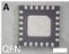

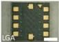

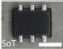

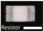

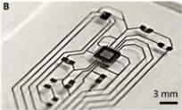

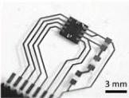

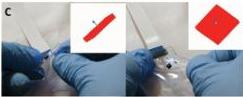

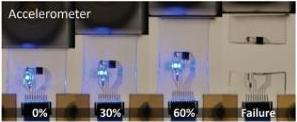

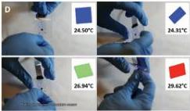

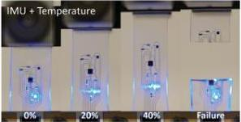

Figure 7. Component package architectures and functional circuits. A) Photos showing the pin architecture of QFN, SoT, LGA packages and a thick film resistor from the bottom view. Scale bars: 1 mm. B) Photo on the left shows the bottom view of soft digital IMU + temperature sensor circuit and the photo on the right shows the bottom view of soft analog accelerometer circuit. C) Representative images of functioning analog accelerometer circuit with real-time animated block. Animated block's orientation information comes from the accelerometer circuit. Photos show orientation sensing in roll and pitch angles under bending and stretching. D) Representative images of functioning IMU + temperature sensor circuit with real-time animated block. Animated block's orientation information comes from the IMU while the color of the block shows the temperature sensed from the sensor. (Top row) Photos show orientation sensing in roll, pitch, and yaw angles. (Bottom row) Photos show orientation and temperature sensing. E) Representative images that show the circuits tested until failure at different applied strains. (Top row) Tensile testing of analog accelerometer circuit. (Bottom row) Tensile testing of digital IMU + temperature sensor circuit.

Copper (often used in component pins with a thin layer of tin or gold finish) and aluminum are commonly used in IC components. Gallium and its alloys are known to significantly corrode Al[63-65] through intergranular diffusion, and can alloy with and diffuse into Cu.[19,66,67] One concern with bringing LM into direct contact with component pins is how this interfacing may affect the lifetime of the IC components. For EGaIn and Galinstan, respectively, Tang et al.[19] and Ralphs et al.[66] reported that when Cu and LM are brought into contact, a CuGa₂ intermetallic compound is formed and In (and Sn in case of Galinstan) is dispersed into the LM solution without alloying with Cu. To understand the distribution and penetration of EGaIn at the component pin interface, we analyzed an analog accelerometer chip from a 4-month-old LM circuit and a digital IMU chip from a 6-month-old LM circuit kept at room temperature. The removed ICs were cleaned, cross-sectioned, and polished for energy-dispersive X-ray spectroscopy (EDS) analysis. Fresh ICs with no EGaIn were also prepared in the same way and their elemental maps were also obtained using EDS for comparison.

Figures S12 and S13 (Supporting Information) show the elemental maps of the component pin cross-sections for the analog accelerometer and digital IMU ICs, respectively. Referring to Figure S12 (Supporting Information), the analog accelerometer IC has a layered structure consisting of Au, Ni, Cu, Al, and Si. A thin layer of Au (as commonly used in ICs) is at the pin surface and Ni is used as a diffusion barrier between Au and Cu. When we investigated the same layered structure for the EGaIn interfaced chip, we observed that Ga is penetrated into Au and Au–Ga layer on the pin surface remains intact through the cleaning and sectioning steps. We also observed that penetrated Ga diffused through Au layer all the way to the Ni layer. However, Ga penetration was seen to stop at the Ni layer and no Ga is observed in the remaining layers. Moreover, no In is observed in the obtained elemental map. Referring to Figure S13 (Supporting Information), the digital IMU IC has a layered structure consisting of Ni and Cu. According to the manufacturer's datasheet, the pin surface has a Au–Pd–Ni finish (Au: 3–50 nm, Pd: 20–100 nm, Ni: 500 nm–2 μm in thickness, as reported by manufacturer), however, the amounts of Au and Pd were not in the reliable detection range for EDS. The elemental map of the EGaIn interfaced IMU chip shares a similar trend with the accelerometer chip, i.e., Ga was intact on the component pin surface, Ga penetration seemingly stopped at the Ni layer, and no In was observed.

These results indicate that Ni is acting as a diffusion barrier between Ga and Cu, as reported in ref. [63] for EGaIn–Al and in ref. [68] for GaInSn–Cu systems, and prevents Ga from penetrating inside the IC. Alternatively, since Au and Pd alloys with Ga,[22] Ga may be immobilized by the formation of intermetallics with Au or Au/Pd at the component surface, as described by Ralphs et al.[66] for Cu–Ga system. The absence of In at the surface suggests that EGaIn might be following the same reaction trend with Cu and EGaIn system.

The circuits demonstrated here are composed of components with standard IC packaging. Hence, conventional pick-and-place machines that are used for the standard PCB assembly can be extended to the fabrication of the LM-based stretchable circuits without the need of chip-mounting adapters or other specialized components. All the fabricated samples were functional at least four months after initial testing at the time of submission.

### 3. Conclusion

Reliable electromechanical interfacing of liquid metal interconnects with IC chips and other microelectronics can provide a basis to form multifunctional stretchable circuit assemblies. By investigating the electromechanical interface between component pins and LM interconnects, we observed that (i) the electrical connection between LM and pins does not form immediately and (ii) the mechanical interface is prone to premature failure. By utilizing HCl vapor treatment, a novel interfacing method, we overcome these shortcomings and demonstrate mechanically and electrically robust connections between component pins and LM leads. We concluded that HCl treatment not only enables better connections but also allows components to self-align with respect to the terminals of the LM interconnects. By combing this interfacing technique with biphasic LM circuit architectures, we have established a method to produce fully functional stretchable circuits composed of EGaIn wiring and packaged microelectronics embedded in soft elastomers. We demonstrated the applicability of the fabrication and interfacing method by fabricating multifunctional circuits that contain packaged microelectronics components with a variety of standardized pin architectures. We showed that these circuits, which are designed to sense orientation and temperature, remain functional under mechanical deformation.

While compatible with surface-mount microelectronics, the methods described here are unsuitable to use with through-hole electronic components. Currently, the fabrication method is also limited to single layer circuit layouts. Considering the highly corrosive nature of EGaIn to Al, direct interfacing is limited to microelectronic components that do not have Al at the contact surface. Due to the use of HCl vapor during the “soldering” step, the fabrication technique is also limited to packaged components that are not sensitive to short-term application of corrosive vapors. Future work includes extending the current fabrication method into multilayer stretchable electronics and finding less corrosive alternatives for LM oxide removal and wetting.

### 4. Experimental Section

Materials: The PDMS used in the fabrication of circuits and test samples was prepared with Sylgard 184 (Dow Corning, USA) using

a 10:1 oligomer to curing agent ratio. A 3% w/w NaOH solution was prepared by diluting 30% w/v NaOH solution (BDH Chemicals) with deionized (DI) water (100%, McMaster-Carr, USA). DI water and isopropyl alcohol (IPA) (2-propanol ACS 99.5% min, Alfa Aesar, USA) were used to the clean surface of samples after liquid metal deposition and HCl vapor treatment. Eutectic gallium–indium alloy was prepared by mixing Ga (Gallium Source, USA) and In (Gallium Source, USA) at a 3:1 ratio by mass and heating and homogenizing at 190 °C on a hot plate overnight. The circuit designs were made in CircuitMaker (Altium Limited, Australia). HCl vapor was obtained from a one-gallon bottle of 36% w/w aqueous HCl solution (Alfa Aesar, USA).

Fabrication of Tensile Test Specimens: The geometry of the tensile test specimens conforms to ASTM D412 to concentrate strain uniformly at the center portion of the geometry. The mold for the specimen has two components. One portion is to prepare the substrate and the other is for sealing. Two parts were cut from 1.5 mm thick poly(methyl methacrylate) (PMMA) using a CO₂ laser system in the shape of a dog bone (dimensions given in Figure S3, Supporting Information). The first component of the mold was prepared by gluing one of the cut parts to an 8 mm thick PMMA plate. Both components of the mold were drilled to be aligned during sealing. After creating the mold pieces, the substrate portion was treated with a releasing agent (Ease Release 200, Reynolds Advanced Materials, USA), and PDMS was poured inside, degassed under vacuum for 30 min, and cured on a hotplate with 65 °C for 10 h. Next, a 100 nm layer of Cu was sputter deposited (30 W power, 5 mTorr pressure; Perkin-Elmer 8L, USA) on the PDMS substrate along with a 20 nm Cr adhesion layer (30 W power, 20 mTorr pressure). The circuit design was made in CircuitMaker and patterned into the Cr/Cu layer using a commercial UV-laser based PCB prototyping tool with 0.3 W power and 400 mm s⁻¹ marking speed. Next, the elastomeric substrate with copper wetting layer was immersed into 3% w/w NaOH solution completely while keeping the substrate horizontal with respect to the bath. Immediately after immersing, 3% w/w NaOH treated liquid metal droplets were applied to cover the wetting layer by simply placing/jetting liquid metal droplets on the substrate surface using a dropper. After liquid metal was deposited onto the patterned Cu circuit, the coated substrate was dipped horizontally into DI water and IPA to clean residual NaOH and then dried on a hotplate with 60 °C for 10 min. Next, FFC connectors (Amphenol FCI HFW5R-1STE1LF, purchased from Digikey) with FFC cables (Parlex USA LLC 100RS-51B, purchased from Digikey, USA) attached were placed to their designated places. On the test samples with components, a 1/10W 0603 0-Ohm resistor (Samsung Electro-Mechanics America Inc, purchased from Digikey, USA) was placed. Next, HCl vapor was applied to the sample surfaces manually using a dropper. HCl vapor was obtained from 36% w/w aqueous HCl bottle. HCl treated samples were dipped into DI water and IPA and then dried on a hotplate with 60 °C for 10 min. Then the samples were placed inside the first part of the mold and oxygen plasma treated with 30 W and 45 s (Plasma Prep 3, SPI, USA) to activate PDMS surface. Then, the second part of the mold was bolted down the first part, PDMS was poured, and the sample was degassed under vacuum for 30 min. Finally, the samples were cured on a hotplate at 65 °C for 10 h.

Tensile Testing: Both tensile testing up to failure and cyclic tensile testing were performed on a commercial material testing device (5969 Dual Column Testing System, Instron, USA). The tests were conducted on specimens with an integrated microelectronic component (zero-ohm resistor) and specimens without a microelectronic component (i.e., LM-only) were also used for comparison. During the test, the load-displacement and the electrical resistance of the samples were measured. FFC connector cables coming from the samples were connected to a data acquisition board (NI USB-6002, National Instruments, USA) via a voltage divider circuit having a known resistor of 560 Ohms to measure the resistance of the samples during testing. Strain was also measured simultaneously by placing markers with a pen on the samples and taking the video of the test with a stationary camera. The videos were processed with a free video analysis tool (Tracker v4.96). The loading rate for the testing up to failure was 15 mm min⁻¹ while the loading frequency for the cyclic testing was 0.1 Hz. The number of cycles applied for cyclic tensile test was 2000 and the applied strain amplitude was 35% with 5% prestrain applied to accommodate slacking during testing. As such, each cycle included strains between 5% and 40%. The cyclic strain was applied in Instron's preset sawtooth pattern. Acquired data were filtered using a moving average filter of a window size of 100 and plotted using MATLAB (R2016b, MathWorks, USA).

Test Circuits for Electrical Interface Characterization on Rigid PCB: The circuit design for the electrical interface characterization is shown in Figure S4 (Supporting Information) and was made in CircuitMaker software. The design was patterned using a commercial UVLM PCB prototyping on a 0.5 oz single-sided copper laminate (Fab-in-a-box, PulsarProFX USA). To deposit solder paste or liquid metal only on the component pads, a stencil made from laser mask tape (Orange Laser Mask, Ikoniks Imaging, USA) was patterned using the UVLM system to expose only the component pads. The stencil was then laid down on the patterned PCB. The component contact pads were treated with a water-soluble solder flux pen (Kester #2331-ZX, Kester, USA) to remove the thick oxide on the copper pads. For the liquid metal deposited PCBs, masked PCB was dipped into 3% w/w sodium hydroxide (NaOH) treated EGaIn resulted in liquid metal deposition only on the component contact pads, then the mask was removed. Next, the PCB was dipped into DI water and then IPA to clean the surface. Following that, the PCB was dried on a hotplate with 60 °C for 10 min. Wires were soldered on the wire contact pads where the measurements to be taken using 0.16 ± 0.01 gr commercial 15 mil flux core solder (Sn63Pb37 #50/245, Kester, USA). Finally, a 1/10W 0603 0 Ohm resistor (RC 1608 Samsung Electro-Mechanics America Inc, purchased from Digikey, USA) was aligned and placed on the liquid metal on the component contact pads using a custom-made manual pick and place setup that contains a vacuum chuck. After the alignment, the component was released from a distance of ~500 μm from the board surface. For the sample sets where HCl vapor was applied, 20 mL HCl vapor was applied using a syringe pump (PHD 220, Harvard Apparatus, USA) with a flow rate of 42 mL min⁻¹ by placing syringe needle on top of the component with a stand-off distance of ~2.5 mm away from the PCB. The entire HCl vapor deposition setup was placed under a fume hood with 100 ft min⁻¹ flow rate. After HCl vapor treatment, the PCB was immersed into DI water and then IPA to clean the surface. Following that, the PCB was dried on a hotplate with 60 °C for 10 min. For the PCBs where solder paste was used as the solder material, solder paste (SMD291AX250T3, Chipquik Inc, USA) was deposited on the component contacts. Next, the mask was removed, a 0603 package 1% 0 Ohm resistor was aligned and placed on the liquid metal on the component contact pads using a custom made manual pick and place setup that contains a vacuum chuck. After the alignment, the component was released from a distance of ~500 μm from the contact pads. Next, solder paste was treated using a commercial reflow oven (T962, SMTHouse, Sweden). Then, wires were soldered on the contact pads where the measurements will be taken using a 0.16 ± 0.01 gr commercial 15 mil flux core solder (Sn63Pb37 #50/245, Kester, USA). Finally, the board was rinsed with DI water and then with IPA to clean the surface. Following that, the PCB was dried on a hotplate with 60 °C for 10 min.

Self-Alignment Test Samples and Data Processing: The circuit design for the self-assignment study is shown in Figure S5 (Supporting Information) and was made in CircuitMaker. Approximately 2 g of PDMS was poured and cured on a 1 in. diameter Si wafer (purchased from Polishing Corp of America, USA) at 65 °C for 10 h. A 100 nm Cu layer with 20 nm Cr adhesion layer was sputter coated, patterned, and EGaIn was deposited on the wetting layer and the specimens were cleaned as described in the "fabrication of tensile test specimens" section. Next, a 1/10W 0603 0 Ohm resistor was placed manually on the contact pads. Profilometry measurements (using NewView, Zygo, USA) and top view photos of the samples before HCl treatment were taken (using Infinitefocus, Alicona, Austria). Next, the samples were treated with 2 mL HCl vapors using a syringe pump (PHD 220, Harvard Apparatus, USA) at a flow rate of 42 mL min⁻¹ by placing a syringe needle on top of the component with a stand-off distance of ~2.5 mm away from the surface. The entire HCl vapor deposition setup was placed under a fume hood with a 100 ft min⁻¹ flow rate. After HCl vapor treatment, the circuit was dipped into DI water and then IPA was used to clean the surface. Following that, the circuit was dried on a hotplate at 60 °C for 10 min. Profilometry measurements and top view photos of the samples after HCl treatment were taken. Using profilometry measurements, the height of the geometric center of the component, roll, and pitch angles relative to the substrate were computed using the profilometry device's native software (MetroPro, Zygo, USA). Using the top view microscopy images of the samples, yaw angle of the component with respect to component pads, eccentricity of component geometric center with respect to the geometric center of the pads in in-plane axes were calculated using a free image editing software (IrfanView 4.44).

Implementations and Testing of IMU Circuits: The circuit designs for the sensor demonstrations are shown in Figures S6 and S7 (Supporting Information) and were made in CircuitMaker. PDMS was poured and cured on standard 1 × 3 in. glass microscope slides (206B2, Karter Scientific, USA). Patterning of the Cu wetting layer, liquid metal deposition, HCl vapor application, and sealing were done as described in "Fabrication of tensile test specimens" section. Sensitive components were placed using custom made manual pick and place setup (Figure S2, Supporting Information) and passive components were placed with the help of a tweezer manually. To test the performance of the first circuit, the circuit was rotated in three Euler angles manually with and without mechanical deformation (Figure 7D), and the 3-axis linear acceleration, 3-axis angular rotation, and 3-axis magnetic field strength were measured from the IMU. In addition, the change in circuit temperature due to contact with the user was recorded from the temperature sensor (Figure 7D). The data from the digital IMU were transformed into the three Euler angles of absolute orientation, and those angles were illustrated in MATLAB (R2016b) as rotations on a rectangular block. Similarly, the temperature sensor data are used to change the color of the animated block in real-time (Video S4, Supporting Information). The performance of the second circuit was demonstrated by applying tilt and pitch to the circuit manually with and without mechanical deformation, while measuring the gravitational acceleration from the sensor (Figure 7C). Using the measured acceleration signal, the tilt and pitch angles were calculated, and the tilt and pitch angles were used to move an animated block in MATLAB (R2016b) in real-time (Video S5, Supporting Information). Data coming from the circuits were acquired using a microcontroller board (Arduino Due, Arduino, USA) and processed and plotted in MATLAB in real-time. The goniometers (ANT 20G-90 and ANT 20G-50, Aerotech, USA) used were rotated with constant speed of 2 and 0.5 deg s⁻¹, respectively, between 0° and 5° and 0° and -5° in pitch and roll angles (Figure S11, Supporting Information). The sample circuits tested under tensile loading up to failure had a thickness of 1.9 ± 0.05 mm. The tensile testing of these samples up to failure was done as described in "Tensile testing" section.

Metallurgical Sample Preparation: EGaIn treated KXTC9-2050 analog accelerometer chip and MPU9250 digital IMU chips were salvaged from prepared LM-based circuits after 6 months. The excess EGaIn was thoroughly cleaned from the component pin surfaces with IPA. After cleaning the chips were mounted on a custom made stainless steel jig using Crystalbond 509 (Aremco Products Inc, US). The samples were first ground down starting from 240 grit paper to 4000 grit SiC papers. Then polished with 1 and 0.5 μm diamond papers, respectively. All the samples were investigated using a scanning electron microscope (Quanta 600, FEI Company, US) and elemental maps were obtained using EDS up to 40 keV range.

## Supporting Information

Supporting Information is available from the Wiley Online Library or from the author.

## Acknowledgements

ONR Grants # N00014-16-2301 and N00014-14-10778, Code 34, Bio-Inspired Autonomous Systems (PM: Tom McKenna). This work

Adv. Mater. Interfaces 2018, 5, 1701596

1701596 (11 of 13)

© 2018 WILEY-VCH Verlag GmbH & Co. KGaA, Weinheim

---

**ADVANCED SCIENCE NEWS**
www.advancedsciencenews.com

**ADVANCED MATERIALS INTERFACES**
www.advmatinterfaces.de

was supported in part by the Pennsylvania Infrastructure Technology Alliance, a partnership of Carnegie Mellon, Lehigh University, and the Commonwealth of Pennsylvania's Department of Community and Economic Development (DCED). This study was supported in part by Siemens Corporate Technology USA. This paper was amended on May 23, 2018 to correct the third author's name.

## Conflict of Interest

The authors declare no conflict of interest.

## Keywords

eutectic gallium–indium, liquid phase microelectronics, microelectronics component integration, soft electronics, stretchable electronics

Received: December 6, 2017

Revised: January 30, 2018

Published online: March 15, 2018

[1] M. D. Dickey, *ACS Appl. Mater. Interfaces* **2014**, *6*, 18369.
[2] M. L. Hammock, A. Chortos, B. C. K. Tee, J. B. H. Tok, Z. Bao, *Adv. Mater.* **2013**, *25*, 5997.
[3] M. D. Dickey, R. C. Chiechi, R. J. Larsen, E. A. Weiss, D. A. Weitz, G. M. Whitesides, *Adv. Funct. Mater.* **2008**, *18*, 1097.
[4] M. Kaltenbrunner, T. Sekitani, J. Reeder, T. Yokota, K. Kuribara, T. Tokuhara, M. Drack, R. Schwödiauer, I. Graz, S. Bauer-Gogonea, S. Bauer, T. Someya, *Nature* **2013**, *499*, 458.
[5] V. Martinez, F. Stauffer, M. O. Adagunodo, C. Forro, J. Vörös, A. Larmagnac, *ACS Appl. Mater. Interfaces* **2015**, *7*, 13467.
[6] T. Takahashi, K. Takei, A. G. Gillies, R. S. Fearing, A. Javey, *Nano Lett.* **2011**, *11*, 5408.
[7] D. J. Lipomi, M. Vosgueritchian, B. C.-K. Tee, S. L. Hellstrom, J. A. Lee, C. H. Fox, Z. Bao, *Nat. Nanotechnol.* **2011**, *6*, 788.
[8] E. Carone, L. D'Ilario, A. Martinelli, *J. Appl. Polym. Sci.* **2001**, *83*, 857.
[9] G. Abbati, E. Carone, L. D. Ilario, A. Martinelli, *J. Appl. Polym. Sci.* **2003**, *89*, 2516.
[10] Y. Zhang, S. Wang, X. Li, J. A. Fan, S. Xu, Y. M. Song, K. J. Choi, W. H. Yeo, W. Lee, S. N. Nazaar, B. Lu, L. Yin, K. C. Hwang, J. A. Rogers, Y. Huang, *Adv. Funct. Mater.* **2014**, *24*, 2028.
[11] H. Keum, M. McCormick, P. Liu, Y. Zhang, F. G. Omenetto, *Science* **2011**, *333*, 838.
[12] S. Xu, Y. Zhang, J. Cho, J. Lee, X. Huang, L. Jia, J. A. Fan, Y. Su, J. Su, H. Zhang, H. Cheng, B. Lu, C. Yu, C. Chuang, T.-I. Kim, T. Song, K. Shigeta, S. Kang, C. Dagdeviren, I. Petrov, P. V. Braun, Y. Huang, U. Paik, J. A. Rogers, *Nat. Commun.* **2013**, *4*, 1543.
[13] D.-H. Kim, J. Song, W. M. Choi, H.-S. Kim, R.-H. Kim, Z. Liu, Y. Y. Huang, K.-C. Hwang, Y. Zhang, J. A. Rogers, *Proc. Natl. Acad. Sci. USA* **2008**, *105*, 18675.
[14] S. P. Lacour, J. Jones, S. Wagner, T. Li, Z. Suo, *Proc. IEEE* **2005**, *93*, 1459.
[15] I. D. Joshipura, H. R. Ayers, C. Majidi, M. D. Dickey, *J. Mater. Chem. C* **2015**, *3*, 3834.
[16] Y. Lu, Q. Hu, Y. Lin, D. B. Pacardo, C. Wang, W. Sun, F. S. Ligler, M. D. Dickey, Z. Gu, *Nat. Commun.* **2015**, *6*, 10066.
[17] M. D. Dickey, *Adv. Mater.* **2017**, *29*, 1.
[18] J. Wissman, M. D. Dickey, C. Majidi, *Adv. Sci.* **2017**, *1700169*, 1700169.
[19] J. Tang, X. Zhao, J. Li, R. Guo, Y. Zhou, J. Liu, *ACS Appl. Mater. Interfaces* **2017**, *9*, 35977.
[20] Y. R. Jeong, J. Kim, Z. Xie, Y. Xue, S. M. Won, G. Lee, S. W. Jin, S. Y. Hong, X. Feng, Y. Huang, J. A. Rogers, J. S. Ha, *NPG Asia Mater.* **2017**, *9*, e443.
[21] G. Li, X. Wu, D.-W. Lee, *Sens. Actuators B* **2015**, *221*, 1114.
[22] A. Hirsch, H. O. Michaud, A. P. Gerratt, S. de Mulatier, S. P. Lacour, *Adv. Mater.* **2016**, *28*, 4507.
[23] Y. Zheng, Z.-Z. He, J. Yang, J. Liu, *Sci. Rep.* **2014**, *4*, 4588.
[24] Q. Wang, Y. Yu, J. Yang, J. Liu, *Adv. Mater.* **2015**, *27*, 7109.
[25] J. W. Boley, E. L. White, G. T. C. Chiu, R. K. Kramer, *Adv. Funct. Mater.* **2014**, *24*, 3501.
[26] Y. Zheng, Z. He, Y. Gao, J. Liu, *Sci. Rep.* **2013**, *3*, 1786.
[27] Y. Gao, H. Li, J. Liu, *PLoS One* **2012**, *7*, e45485.
[28] C. Ladd, J. H. So, J. Muth, M. D. Dickey, *Adv. Mater.* **2013**, *25*, 5081.
[29] A. Gannarapu, B. A. Gozen, *Adv. Mater. Technol.* **2016**, *1*, 1600047.
[30] Y.-L. Park, C. Majidi, R. Kramer, P. Bérard, R. J. Wood, *J. Micromech. Microeng.* **2010**, *20*, 125029.
[31] A. Fassler, C. Majidi, *Lab Chip* **2013**, *13*, 4442.
[32] A. Fassler, C. Majidi, *Smart Mater. Struct.* **2013**, *22*, 55023.
[33] D. Kim, J. H. Yoo, Y. Lee, W. Choi, K. Yoo, J. B. J. Lee, *IEEE Int. Conf. Micro Electro Mech. Syst.* **2014**, 967.
[34] G. Li, X. Wu, D.-W. Lee, *Lab Chip* **2016**, *16*, 1366.
[35] T. Lu, L. Finkenauer, J. Wissman, C. Majidi, *Adv. Funct. Mater.* **2014**, *24*, 3351.
[36] A. Tabatabai, A. Fassler, C. Usiak, C. Majidi, *Langmuir* **2013**, *29*, 6194.
[37] B. A. Gozen, A. Tabatabai, O. B. Ozdoganlar, C. Majidi, *Adv. Mater.* **2014**, *26*, 5211.
[38] H. J. Kim, T. Maleki, P. Wei, B. Ziaie, *J. Microelectromech. Syst.* **2009**, *18*, 138.
[39] R. K. Kramer, C. Majidi, R. J. Wood, *Adv. Funct. Mater.* **2013**, *23*, 5292.
[40] M. G. Kim, H. Alrowais, S. Pavlidis, O. Brand, *Adv. Funct. Mater.* **2017**, *27*, 1604466.
[41] Y. G. Moon, J. B. Koo, N. M. Park, J. Y. Oh, B. S. Na, S. S. Lee, S. D. Ahn, C. W. Park, *IEEE Trans. Electron Devices* **2017**, *64*, 1.
[42] S. H. Jeong, A. Hagman, K. Hjort, M. Jobs, J. Sundqvist, Z. Wu, *Lab Chip* **2012**, *12*, 4657.
[43] J. Wissman, T. Lu, C. Majidi, *Proc. IEEE Sens.* **2013**, *3*.
[44] S. H. Jeong, K. Hjort, Z. Wu, *Sci. Rep.* **2015**, *5*, 8419.
[45] M. R. Khan, J. Bell, M. D. Dickey, *Adv. Mater. Interfaces* **2016**, *3*, 1600546.
[46] H. J. Koo, J. H. So, M. D. Dickey, O. D. Velev, *Adv. Mater.* **2011**, *23*, 3559.
[47] J. H. So, H. J. Koo, M. D. Dickey, O. D. Velev, *Adv. Funct. Mater.* **2012**, *22*, 625.
[48] Y. Huang, Y. Wang, L. Xiao, H. Liu, W. Dong, Z. Yin, *Lab Chip* **2014**, *14*, 4205.
[49] J. H. So, J. Thelen, A. Qusba, G. J. Hayes, G. Lazzi, M. D. Dickey, *Adv. Funct. Mater.* **2009**, *19*, 3632.
[50] A. V. Diebold, A. M. Watson, S. Holcomb, C. Tabor, D. Mast, M. D. Dickey, J. Heikenfeld, *J. Micromech. Microeng.* **2017**, *27*, 25010.
[51] S. Cheng, Z. Wu, *Lab Chip* **2010**, *10*, 3227.
[52] T. Lu, J. Wissman, Ruthika, C. Majidi, *ACS Appl. Mater. Interfaces* **2015**, *7*, 26923.
[53] T. Lu, E. J. Markvicka, Y. Jin, C. Majidi, *ACS Appl. Mater. Interfaces* **2017**, *9*, 22055.
[54] B. Zhang, Q. Dong, C. E. Korman, Z. Li, M. E. Zaghloul, *Sci. Rep.* **2013**, *3*, 1098.
[55] C. W. Park, Y. G. Moon, H. Seong, S.-W. Jung, J.-Y. Oh, B. S. Na, N.-M. Park, S. S. Lee, S. G. Im, J. B. Koo, *ACS Appl. Mater. Interfaces* **2016**, *8*, 15459.
[56] L. Cademartiri, M. M. Thuo, C. A. Nijhuis, W. F. Reus, S. Tricard, J. R. Barber, R. N. S. Sodhi, P. Brodersen, C. Kim, R. C. Chiechi, G. M. Whitesides, *J. Phys. Chem. C* **2012**, *116*, 10848.

*Adv. Mater. Interfaces* **2018**, *5*, 1701596

1701596 (12 of 13)

© 2018 WILEY-VCH Verlag GmbH & Co. KGaA, Weinheim

---

**ADVANCED  
SCIENCE NEWS**

www.advancedsciencenews.com

**ADVANCED  
MATERIALS  
INTERFACES**

www.advmatinterfaces.de

- [57] R. K. Kramer, J. W. Boley, H. A. Stone, J. C. Weaver, R. J. Wood, *Langmuir* **2014**, *30*, 533.
- [58] O. Krammer, *Microelectron. Reliab.* **2014**, *54*, 457.
- [59] *IPC-2221A Generic Standard on Printed Board Design*, Institute Of Printed Circuits, **2003**.
- [60] A. E. Oberth, R. S. Bruenner, *J. Rheol.* **1965**, *9*, 165.
- [61] N. Naserifar, P. R. LeDuc, G. K. Fedder, *Adv. Mater.* **2016**, *28*, 3584.
- [62] K. Doudrick, S. Liu, E. M. Mutunga, K. L. Klein, V. Damle, K. K. Varanasi, K. Rykaczewski, *Langmuir* **2014**, *30*, 6867.
- [63] W. R. Hunter, R. T. Williams, *Nucl. Instrum. Methods Phys. Res.* **1984**, *222*, 359.
- [64] M. H. Kamdar, *Treatise Mater. Sci. Technol.* **1983**, *25*, 361.
- [65] M. Rajagopalan, M. A. Bhatia, M. A. Tschopp, D. J. Srolovitz, K. N. Solanki, *Acta Mater.* **2014**, *73*, 312.
- [66] M. I. Ralphs, N. Kemme, P. B. Vartak, E. Joseph, S. Tipnis, S. Turnage, K. N. Solanki, R. Y. Wang, K. Rykaczewski, *ACS Appl. Mater. Interfaces* **2017**, *10*, 2083.
- [67] Y. G. Deng, J. Liu, *Appl. Phys. A: Mater. Sci. Process.* **2009**, *95*, 907.
- [68] N. B. Morley, J. Burris, L. C. Cadwallader, M. D. Nornberg, *Rev. Sci. Instrum.* **2008**, *79*, 3.

*Adv. Mater. Interfaces* **2018**, *5*, 1701596

1701596 (13 of 13)

© 2018 WILEY-VCH Verlag GmbH & Co. KGaA, Weinheim